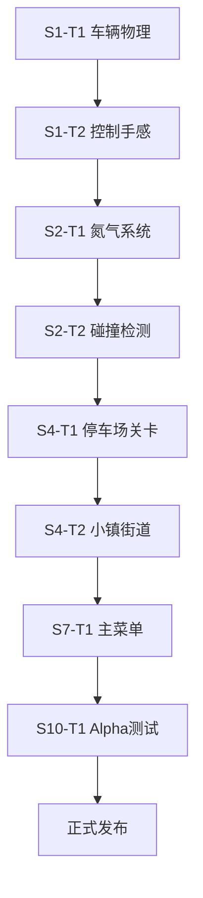

# NO BRAKE: Turbo Rush - 增强任务规划

## 一、执行摘要

基于现有规划文档的深度分析，本增强规划整合了任务依赖关系、资源优化配置、风险缓策和质量管理流程，确保项目按时高质量交付。

**核心改进点：**
- 任务依赖可视化与关键路径识别
- 精细化资源分配与负荷平衡
- 分层级风险管理与应急预案
- 全流程质量保证体系

---

## 二、任务依赖网络分析

### 2.1 关键路径识别



### 2.2 任务依赖矩阵

| 任务ID | 前置任务 | 后续任务 | 并行任务 | 关键度 |
|--------|----------|----------|----------|--------|
| S1-T1  | - | S1-T2, S1-T3 | S1-T4, S1-T5 | ★★★ |
| S1-T2  | S1-T1 | S2-T1, S2-T2 | S1-T3 | ★★★ |
| S2-T1  | S1-T2 | S2-T3, S4-T1 | S2-T2 | ★★ |
| S2-T2  | S1-T2 | S4-T1 | S2-T1 | ★★ |
| S4-T1  | S2-T1, S2-T2 | S4-T2 | S4-T7 | ★★ |
| S7-T1  | S4-T6 | S7-T2, S7-T3 | S7-T5 | ★★ |
| S10-T1 | S7-T8 | S10-T2, S10-T3 | S10-T4 | ★★★ |

---

## 三、资源分配优化

### 3.1 精细化资源分配

| 角色 | Week 1-2 | Week 3-4 | Week 5-6 | Week 7-8 | Week 9 | Week 10-11 | Week 12-14 |
|------|----------|----------|----------|----------|--------|------------|------------|
| 制作人 | 100% | 80% | 70% | 60% | 80% | 100% | 100% |
| 技术总监 | 100% | 100% | 90% | 90% | 100% | 80% | 70% |
| 美术总监 | 20% | 60% | 90% | 90% | 100% | 80% | 30% |
| QA负责人 | 10% | 20% | 40% | 60% | 50% | 100% | 100% |

### 3.2 资源负荷平衡

```
技术总监资源分布：
Week 1-2: 核心系统开发 (100%)
Week 3-4: 扩展系统 + 关卡基础 (100%)
Week 5-6: 关卡技术实现 (90%) + Bug修复支持
Week 7-8: UI系统 + 关卡优化 (90%)
Week 9: Steam集成 (100%)
Week 10-11: 优化支持 + 问题修复 (80%)
Week 12-14: 发布准备 + 最终修复 (70%)
```

---

## 四、风险管理升级

### 4.1 风险评估矩阵

| 风险类别 | 风险描述 | 概率 | 影响 | 风险值 | 缓解策略 | 责任人 | 监控指标 |
|----------|----------|------|------|--------|----------|--------|----------|
| 技术风险 | 车辆物理手感不达标 | 高 | 高 | 9 | 早期原型迭代 | 技术总监 | 玩家测试反馈 |
| 进度风险 | 关卡开发延迟 | 中 | 高 | 6 | 预留缓冲时间 + 分阶段交付 | 制作人 | 完成率 vs 计划 |
| 质量风险 | 游戏难度失衡 | 高 | 中 | 6 | 多轮测试 + 难度曲线验证 | QA负责人 | 通关率统计 |
| 市场风险 | Steam审核被拒 | 低 | 高 | 3 | 提前合规检查 | 制作人 | 审核状态 |
| 团队风险 | 人员变动 | 低 | 高 | 3 | 文档化 + 知识共享 | 制作人 | 团队稳定性 |

### 4.2 应急预案

#### 高风险预案（风险值 ≥ 8）

**预案1：物理系统重构**
- 触发条件：原型测试满意度 < 70%
- 执行步骤：
  1. 立即启动物理系统重构计划
  2. 增加2天缓冲时间用于手感调优
  3. 邀请外部玩家进行盲测
  4. 根据反馈调整物理参数

**预案2：核心功能延期**
- 触发条件：关键路径任务延迟 > 3天
- 执行步骤：
  1. 重新评估任务优先级
  2. 非核心功能移至下个Sprint
  3. 增加开发资源投入
  4. 调整里程碑时间表

---

## 五、质量保证体系

### 5.1 QA流程升级

#### 5.1.1 测试金字塔

```
           E2E测试 (5%)
          /         \
       集成测试 (20%)
      /               \
    单元测试 (75%)
```

#### 5.1.2 测试阶段定义

| 测试类型 | 执行时机 | 测试内容 | 通过标准 |
|----------|----------|----------|----------|
| 单元测试 | 开发完成后 | 核心算法、物理计算 | 覆盖率 > 90% |
| 集成测试 | 每日构建 | 系统间交互 | 严重Bug = 0 |
| 功能测试 | 每个Sprint | 功能完整性 | 主要功能正常 |
| E2E测试 | 关键里程碑 | 端到端流程 | 用户流程顺畅 |

### 5.2 Bug分级管理

| 级别 | 定义 | 处理时间 | 影响范围 |
|------|------|----------|----------|
| Blocker | 阻止核心功能 | 24小时内 | 整体系统 |
| Critical | 核心功能异常 | 3天内 | 主要功能 |
| Major | 功能缺陷 | 1周内 | 影响体验 |
| Minor | 优化建议 | 2周内 | 次要问题 |
| Trivial | UI文本等 | 1个月内 | 不影响游戏 |

### 5.3 质量门禁

| 门禁点 | 检查内容 | 通过标准 |
|--------|----------|----------|
| Sprint启动 | 前置任务完成率 | 100% |
| Sprint中期 | 进度符合度 | ≥ 80% |
| Sprint结束 | 功能完整性 | 主要功能100%正常 |
| 里程碑 | 质量指标 | Bug数量 < 5个 |
| 发布准备 | 综合质量 | 严重Bug = 0 |

---

## 六、沟通与协作机制

### 6.1 会议计划

| 会议类型 | 频率 | 参与者 | 时长 | 目标 |
|----------|------|--------|------|------|
| 每日站会 | 每天 | 全体 | 15分钟 | 同步进度，解决问题 |
| Sprint计划会 | Sprint开始 | 全体 | 2小时 | 制定Sprint目标 |
| Sprint评审会 | Sprint结束 | 全体 + 利益相关者 | 1小时 | 展示成果，获取反馈 |
| Sprint回顾会 | Sprint结束 | 团队 | 1小时 | 总结经验教训 |
| 里程碑评审 | 关键节点 | 管理层 + 团队 | 2小时 | 确认项目进展 |

### 6.2 工具链配置

| 工具类型 | 推荐工具 | 用途 |
|----------|----------|------|
| 项目管理 | Jira + Confluence | 任务跟踪 + 文档管理 |
| 代码管理 | Git + GitHub | 版本控制 + 代码审查 |
| 沟通工具 | Slack + Discord | 实时沟通 + 文件共享 |
| 文档协作 | Google Workspace | 协同编辑 + 文档管理 |
| 持续集成 | GitHub Actions | 自动化测试 + 部署 |

### 6.3 文档规范

| 文档类型 | 更新频率 | 负责人 | 审阅机制 |
|----------|----------|--------|----------|
| 技术设计 | 功能变更时 | 技术总监 | 技术团队 |
| 项目计划 | 每周更新 | 制作人 | 管理层 |
| 进度报告 | 每周五 | 各角色 | 团队会议 |
| 风险登记 | 按需更新 | 制作人 | 风险审查 |
| QA报告 | 每Sprint | QA负责人 | 团队评审 |

---

## 七、范围管理

### 7.1 范围界定

#### 7.1.1 确保范围 (In Scope)

- 核心玩法：无刹车赛车机制
- 52个主关卡 + 5个BOSS关
- 基础UI系统（主菜单、暂停、结算）
- 评分系统和星级评价
- 存档功能
- Steam基本集成（成就、云存档）
- 8-bit风格像素美术
- 60 FPS流畅体验

#### 7.1.2 暂缓范围 (Out of Scope - Phase 1)

- 多人在线对战
- 自定义关卡编辑器
- 动态难度系统
- 语音支持
- 复杂的动画序列

### 7.2 变更控制流程

```
变更请求提交 → 影响评估 → 成本/时间分析 → 
优先级评审 → 决策 → 计划调整 → 执行监控
```

#### 变更评估标准

| 影响维度 | 评估指标 | 权重 |
|----------|----------|------|
| 进度影响 | 延迟天数 | 30% |
| 质量影响 | Bug风险 | 25% |
| 成本影响 | 额外工时 | 20% |
| 范围影响 | 功能复杂度 | 15% |
| 用户价值 | 玩家满意度 | 10% |

---

## 八、迭代优化计划

### 8.1 持续改进机制

#### 8.1.1 Sprint回顾重点

| 回顾维度 | 关注点 | 改进措施 |
|----------|--------|----------|
| 流程效率 | 任务完成时间 | 优化任务分解 |
| 技术债务 | 代码质量 | 定期重构 |
| 团队协作 | 沟通效率 | 调整会议节奏 |
| 质量控制 | Bug发现时机 | 前移测试环节 |
| 资源利用 | 工时利用率 | 优化分配 |

#### 8.1.2 优化迭代周期

```
每月评估一次项目健康度：
├── 进度偏差分析
├── 资源负荷检查
├── 质量指标评估
├── 风险状态更新
└── 调整下月计划
```

### 8.2 知识管理

| 知识类型 | 存储方式 | 访问权限 | 更新机制 |
|----------|----------|----------|----------|
| 技术文档 | Confluence | 团队内部 | 实时更新 |
| 最佳实践 | 内部Wiki | 全员开放 | 月度总结 |
| 问题解决 | Jira + 知识库 | 按需授权 | 问题解决后 |
| 进度记录 | 项目管理工具 | 管理层 | 每周更新 |

---

## 九、成功标准与KPI

### 9.1 项目成功指标

| 类别 | 指标 | 目标值 | 测量方式 |
|------|------|--------|----------|
| 进度 | 按时交付率 | 100% | 里程碑对比 |
| 质量 | 严重Bug数量 | < 3个 | QA测试报告 |
| 范围 | 功能完整性 | 100% | 需求对照表 |
| 成本 | 预算偏差 | < 10% | 成本跟踪 |
| 团队 | 满意度 | > 80% | 团队调查 |

### 9.2 业务成功指标

| 指标 | 目标值 | 测量周期 | 数据来源 |
|------|--------|----------|----------|
| Steam评分 | > 80% | 发布后1月 | Steam商店 |
| 销售量 | > 1000份 | 发布后3月 | Steam数据 |
| 玩家留存率 | Week 1: 60% | 每日 | Steam API |
| 完成率 | Chapter 1: 80% | 每周 | 存档数据 |

---

## 十、下一步行动

### 10.1 立即行动项

- [ ] 召开项目启动会议，确认团队分工
- [ ] 建立项目管理工具链（Jira + GitHub）
- [ ] 制定详细的第一周任务分解
- [ ] 设置风险预警机制和监控指标
- [ ] 优化资源配置，确保关键路径资源充足

### 10.2 第一周重点任务

| 任务 | 负责人 | 优先级 | 预计工时 | 交付物 |
|------|--------|--------|----------|--------|
| 完善项目章程 | 制作人 | P0 | 4h | 项目章程文档 |
| 技术架构确认 | 技术总监 | P0 | 8h | 架构图确认 |
| 美术风格定稿 | 美术总监 | P0 | 8h | 美术风格指南 |
| QA流程建立 | QA负责人 | P0 | 4h | QA计划文档 |
| 开发环境搭建 | 技术总监 | P1 | 8h | 可用开发环境 |

---

*文档版本：2.0*  
*更新日期：2026-04-22*  
*制作人：Hermes Agent*  
*审核状态：待管理层确认*